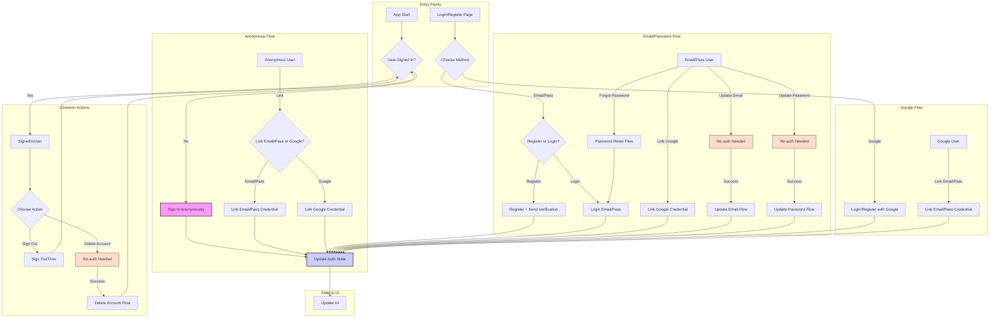

# Codebase Summary

## Recent Changes

### Authentication System Rebuild (Completed - Objective 26)

- **Completed a full rebuild of the authentication system** (`AuthService` and related UI/provider integrations) for simplicity, robustness, and adherence to best practices.
- Implemented a clean foundation covering Anonymous, Email/Password, and Google providers, including all linking, update, re-authentication, and deletion flows as per the defined plan.
- Preserved the existing UI/UX while refactoring the backend logic.
- Corrected numerous method calls and provider interactions across the affected files (`auth_page.dart`, `register_page.dart`, `login_page.dart`, `account_settings_page.dart`, `reset_password_page.dart`, `link_accounts_dialog.dart`, `link_email_password_dialog.dart`, `auth_provider.dart`, `security_migration_provider.dart`, `email_verification_checker.dart`).
- **This rebuild supersedes many previous incremental fixes** (Objectives 17, 18, 20, 21, 22, 23, 25). Details of those fixes are retained below for historical context but the core logic is now part of the unified rebuild.

### Firebase Authentication Fixes (Superseded by Rebuild)

- (Historical context retained) Fixed several issues with Firebase Authentication flows.

### UI Improvements for Authentication

- Updated logo display in authentication screens.
- Updated Google authentication icon in profile page.

### Email Display Simplification

- Removed redundant email display under "Account Information".

### Color Handling Improvements

- Updated all instances of `withAlpha()` to use the modern `withValues(alpha: value)` approach.

### Security Enhancements (Partially Superseded by Rebuild)

- Implemented security improvements in Firestore rules (role-based access, validation, limits).
- (AuthService logic related to security was handled within the rebuild).

### Google Authentication Flow Improvements (Superseded by Rebuild)

- (Historical context retained) Fixed issues with Google authentication flow.

### Account Deletion Flow Improvements (Superseded by Rebuild)

- (Historical context retained) Fixed issue where users still saw their display name after deletion.

### Anonymous User Authentication Flow Improvements (Superseded by Rebuild)

- (Historical context retained) Fixed Forgot Password flow and account linking for anonymous users.

### Dialog Button Readability Improvements

- Updated all dialog buttons to use theme's primary color.

### Email Update Authentication Fix (Superseded by Rebuild)

- (Historical context retained) Fixed issue with inconsistent email state.

### Theme System Improvements

- Removed ContrastExtension dependency.
- Simplified theme handling using standard Material ColorScheme.

### SnackBar Theming Improvements

- Created centralized SnackBarHelper utility class.
- Implemented consistent Material 3 container colors.

### AppBar and Navigation Bar Theming Consistency

- Created AppBarFactory utility class.
- Updated AppBar and NavigationBar theming.

### Profile and Account Settings Consolidation

- Consolidated Profile and Account Settings pages.

### Other Authentication Improvements (Superseded by Rebuild)

- (Historical context retained) Enhanced email verification, account deletion, re-authentication, token refresh, error messages, and profile page structure.

### Key Components

#### Auth Service (lib/core/services/auth_service.dart) - **(Rebuilt)**

- **Status:** Rebuilt for simplicity and robustness.
- **Functionality:** Provides clear, direct methods for all core authentication flows using the `FirebaseAuth.instance` SDK:
  - Anonymous, Email/Password, Google sign-in/registration.
  - Linking providers (Anonymous -> Email/Pass, Anon -> Google, Email/Pass -> Google, Google -> Email/Pass).
  - Account management (Password Reset, Email Update, Password Update, Sign Out, Deletion).
  - Re-authentication (Email/Password, Google).
  - Provider Unlinking.
  - Profile Updates.
  - Email Verification handling.
- **Error Handling:** Uses custom `AuthException` with `AuthErrorCategory` for structured error reporting.
- **Dependencies:** Interacts with `UserRepository` for Firestore data consistency, uses `Talker` for logging.

#### Email Verification Checker (lib/core/providers/email_verification_checker.dart)

- Monitors email verification status periodically for users with unverified email/password accounts.
- Uses the rebuilt `AuthService` (`handleEmailVerificationComplete`) to update state upon verification.
- Refreshes the router upon successful verification.

#### Profile Page Components

- (Descriptions remain largely unchanged, but interactions now use the rebuilt AuthService via providers)
- **ProfilePage**, **ProfileAuthSection**, **AccountInfoCard**, **AccountActionsCard**, **ProfileHeaderCard**, **ProfileReauthDialog**, **UpdatePasswordDialog**, etc.

#### Authentication Pages

- **LoginPage**, **RegisterPage**, **ResetPasswordPage**, **AuthPage**, **AccountSettingsPage**
- Updated to use the rebuilt `AuthService` via `authServiceProvider`.
- Corrected method calls for sign-in, registration, linking, and error handling.

### Data Flow

- **Authentication Flow (Rebuilt)**

The authentication flow now follows the simplified structure implemented in the rebuilt `AuthService`:

- State management relies on Riverpod providers (`authStateProvider`, `currentUserProvider`) watching changes from the rebuilt `AuthService`.
- UI components react to state changes provided by these providers.

### External Dependencies

#### Firebase Authentication

- Core service for user management, verification, token handling, multiple providers, anonymous auth, and linking. Leveraged directly by the rebuilt `AuthService`.

#### Firestore

- Stores user profile data (`users` collection), managed by `UserRepository`.
- `AuthService` interacts with `UserRepository` to ensure data consistency (e.g., creating user doc on sign-up/link, updating email, deleting user doc).
- Security rules enforce access control based on authentication status and user roles.

### Recent Significant Changes

1. **Authentication System Rebuild (Objective 26):** The most significant recent change, involving a complete rewrite of `AuthService` and updates to all related providers and UI components for improved simplicity, robustness, and maintainability.
2. UI Improvements for Authentication (Logo, Google Icon).
3. Email Display Simplification in Profile.
4. Color Handling Improvements (`withValues`).
5. Security Enhancements (Firestore Rules).
6. Dialog Button Readability Improvements.
7. Theme System Simplification.
8. SnackBar Theming Consistency.
9. AppBar and Navigation Bar Theming Consistency.
10. Profile and Account Settings Consolidation.

- *(Previous auth-specific fixes are now considered part of the rebuild context)*

### User Feedback Integration

- (Remains largely unchanged, focusing on clear SnackBars, dialogs, and loading states, now driven by the rebuilt `AuthService`'s error handling and state updates).

## Core Features

[Previous core features remain unchanged...]

## Architecture

[Previous architecture details remain unchanged...]

## Future Development

1. Deck Builder
2. Card Scanner
3. Price Tracking
4. Collection Import/Export
5. Collection Sharing
6. Favorites and Wishlist
7. Advanced Filtering
8. Batch Operations
