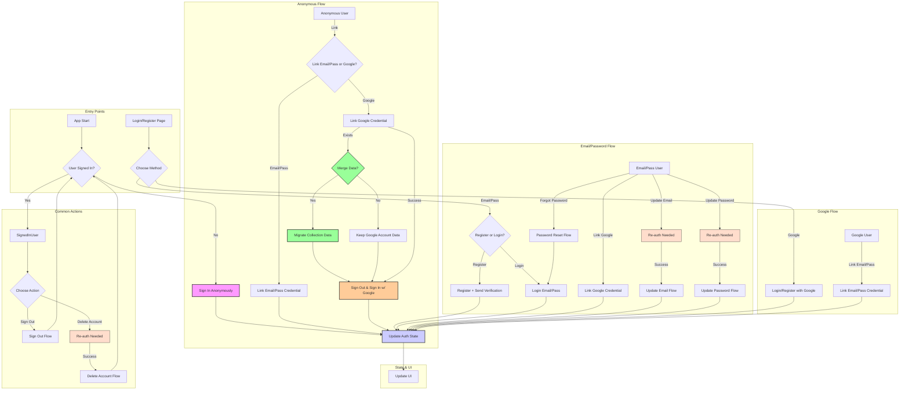

# Current Task

## Previous Objectives (Completed)

[Previous objectives remain unchanged...]

## Current Objective 26 (In Progress - Testing & Troubleshooting)

Rebuild Authentication System for Simplicity and Robustness

### Context

Despite previous attempts to fix and enhance the Firebase Authentication system, ongoing issues and perceived over-engineering necessitated a rebuild. The goal was to create a simpler, more robust system from scratch while preserving the existing UI/UX. Subsequent testing revealed edge cases and state management issues requiring further refinement, particularly with Google account linking for anonymous users.

### Goal

Implement a robust and simplified authentication system using Firebase Authentication (Email/Password, Anonymous, Google) covering all essential user flows, including edge cases and state transitions. **Currently focused on resolving the Google linking redirect issue.**

### Implementation Outcome

1. **Refactored `AuthService` (`lib/core/services/auth_service.dart`):**
    * Rewrote the service focusing on direct, clear calls to the `FirebaseAuth.instance` SDK.
    * Implemented straightforward methods for each core flow (Anonymous, Email/Password, Google, Linking, Updates, Deletion, Re-auth).
    * Simplified error handling using `AuthException` and `AuthErrorCategory`.
    * Maintained necessary interactions with `UserRepository`.
    * Added detailed logging using `Talker`.
    * Corrected `unlinkProvider` logic to prevent removing the last provider.
    * Added `not-anonymous` error code handling.
    * Implemented data migration for anonymous users linking with existing Google accounts:
        * Added `merge_data_decision_dialog.dart` for user confirmation
        * Created `collection_merge_helper.dart` for collection data migration
        * Fixed timing of data migration to occur after successful sign-in
        * Added proper BuildContext handling for async operations
        * Ensured anonymous user data is preserved until migration decision
          * **Note:** Data migration now handles:
            * Collection data (quantities, conditions, purchase info, grading)
            * User settings (theme mode, theme color, recent colors)
            * **Pending:** Deck data (lists, metadata, statistics)
    * **Refined Google linking state management:** Added explicit sign-out from Google and Firebase with delays, plus more logging during the sign-out/sign-in process.

2. **Reviewed/Updated State Management (Riverpod Providers):**
    * Corrected provider instantiations in `security_migration_provider.dart`.
    * Updated `auth_provider.dart` to align with the new `AuthService` and correctly prioritize `isAnonymous` check.
    * Ensured `email_verification_checker.dart` correctly calls `handleEmailVerificationComplete`.
    * Updated `unlinkProviderProvider` to await the reloaded user and invalidate both `currentUserProvider` and `authStateProvider` for better UI reactivity.
    * Updated `auto_auth_provider.dart` to reset `skipAutoAuthProvider` flag only for fully authenticated users.

3. **UI Integration (No Visual Changes):**
    * Updated UI pages/widgets to call the refactored `AuthService` methods correctly.
    * Ensured UI handling of loading states and errors aligns with the new service.
    * Corrected Google sign-in logic in `auth_page.dart` and `register_page.dart` to handle state transitions after sign-out/deletion more robustly (fallback from link to sign-in) and set `skipAutoAuthProvider` flag.
    * Fixed email display for password provider in `ProfileAuthMethods`.
    * Ensured `AccountSettingsPage` watches `currentUserProvider` for reliable UI updates and passes the correct user object down.
    * Corrected email pre-population logic in `LinkEmailPasswordDialog` by passing data reliably from `AccountInfoCard`.
    * Fixed profile page banner logic (`profile_page.dart`) to only show email verification warning when appropriate (`AuthStatus.emailNotVerified`).
    * Fixed state handling after account deletion in `account_settings_page` to allow immediate anonymous sign-in.

4. **Testing:**
    * Manual testing confirmed core flows are functional.
    * Identified and fixed several edge case bugs related to state transitions, unlinking, and dialog pre-population.
    * Verified data migration flow for anonymous users linking with Google accounts.
    * **Currently testing the fix for the Google linking redirect issue.**

5. **Documentation Update:**
    * Updated `currentTask.md` (this file).
    * Updated `projectRoadmap.md`.
    * Updated `codebaseSummary.md`.

### Authentication Flow Diagram

## Next Steps

1. **Test the Google linking flow thoroughly** to confirm the redirect issue is resolved.
2. **Expand data migration system to handle all user data:**
   * Implement deck data migration (lists, metadata, statistics)
   * Add user settings migration (theme, display, layout preferences)
   * Include user preferences migration (favorites, tags, history)
   * Add progress indicators for larger migrations
   * Implement proper error handling and rollback mechanisms
3. Address any remaining edge cases identified during testing.
4. Once authentication is stable, proceed to implement the deck builder feature (Objective from Roadmap).
5. Add card scanner functionality
6. Develop price tracking system
7. Add collection import/export
8. Implement collection sharing
9. Add favorites and wishlist
10. Enhance filtering options
11. Add batch operations
