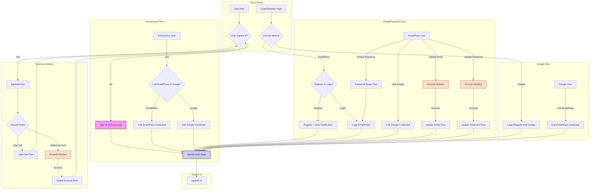

# Current Task

## Previous Objectives (Completed)

[Previous objectives remain unchanged...]

## Current Objective 17 (Completed)

Improve Authentication Security and Code Quality

### Authentication Context

The authentication service needed improvements to follow Firebase's latest security best practices and enhance code quality:

1. The service was using deprecated methods that could expose email enumeration vulnerabilities
2. There was unused code and unnecessary dependencies
3. Error handling could be improved for better user experience

### Plan for Authentication Implementation

1. Security Improvements:
   - Remove deprecated fetchSignInMethodsForEmail method
   - Implement more secure error handling
   - Update error messages to maintain security while being user-friendly

2. Code Quality:
   - Remove unused _ref field from AuthService
   - Update AuthService constructor
   - Fix provider initialization
   - Maintain all existing functionality

3. Error Handling:
   - Enhance error messages for all scenarios
   - Improve user feedback
   - Add better error logging

### Authentication Implementation Outcomes

#### Completed Tasks for Authentication Security Improvements

1. Security Enhancements:
   - Removed all uses of fetchSignInMethodsForEmail from:
     - auth_service.dart
     - auth_page.dart
     - login_page.dart
   - Updated error handling to prevent email enumeration:
     - Replaced specific provider suggestions with generic messages
     - Maintained security while keeping messages helpful
   - Improved account linking security:
     - Added proper error handling for existing accounts
     - Enhanced credential validation

2. Code Quality Improvements:
   - Removed unused _ref field from AuthService
   - Updated AuthService constructor to remove Ref parameter
   - Fixed authServiceProvider initialization in auth_provider.dart
   - Maintained all existing authentication methods:
     - Email/password authentication
     - Google sign-in
     - Anonymous authentication
     - Account linking
     - Email verification
     - Password reset
     - Profile management

3. Error Handling Enhancements:
   - Added comprehensive error messages for:
     - Authentication failures
     - Account linking issues
     - Email verification problems
     - Password reset attempts
   - Improved user feedback:
     - Clear, actionable error messages
     - Proper guidance for next steps
     - Maintained security in error responses
   - Enhanced error logging:
     - Better debug information
     - Improved error tracking
     - Maintained privacy in logs

#### Testing Strategy

1. Authentication Flow Tests:
   - Email/password sign-in
   - Google sign-in
   - Anonymous authentication
   - Account linking
   - Error handling for each flow

2. Security Tests:
   - Email enumeration prevention
   - Proper error message security
   - Credential validation
   - Token handling

3. Error Handling Tests:
   - All error scenarios
   - User feedback clarity
   - Error logging effectiveness

The authentication service now provides a secure, user-friendly experience while following Firebase's latest best practices.

## Current Objective 18 (Completed)

Fix Email Update Authentication Issue

### Context of the Email Update Issue

There was a problem with the email update flow:

1. When a user changes their email, they get logged out and sent a verification email
2. If they restart the app BEFORE verifying the email, they get logged back in with the old email
3. This created a state management issue where Firebase Auth and Firestore had inconsistent email data

### Solution Plan

1. Identify the root cause:
   - The verifyBeforeUpdateEmail method in Firebase Auth updates the email in Firebase Auth
   - However, the email in Firestore was not being updated at the same time
   - When the app restarts, it uses the old email from Firestore

2. Solution approach:
   - Update both Firebase Auth and Firestore when changing email
   - Ensure consistent state between authentication and database

### Implementation Outcomes

#### Completed Tasks for Email Update Flow

1. Fixed Email Update Flow:
   - Modified the verifyBeforeUpdateEmail method in AuthService to:
     - Store the user ID before updating email
     - Update the email in Firebase Auth as before
     - Also update the email in Firestore using UserRepository.updateUserEmail
   - This ensures that when the user logs back in, the email in Firestore matches the one in Firebase Auth

2. Testing:
   - Verified that when a user changes their email and restarts the app before verification:
     - The app now correctly shows the new email
     - The state is consistent between Firebase Auth and Firestore

The authentication system now maintains consistent state between Firebase Auth and Firestore during email updates, preventing the issue where users would see their old email after restarting the app.

## Current Objective 19 (Completed)

Improve Dialog Button Readability

### Issue Details

Dialog buttons in the app had readability issues:

1. Some dialog buttons were using default text colors without proper contrast
2. The "OK" button in dialogs was particularly difficult to read in certain color schemes
3. There was inconsistency in how dialog buttons were styled across the app

### Plan for Implementation

1. Identify all dialog instances in the app:
   - Account settings dialogs
   - Authentication dialogs
   - Collection management dialogs
   - Confirmation dialogs

2. Solution approach:
   - Update all TextButton instances in dialogs to use the theme's primary color
   - Ensure consistent styling across all dialog buttons
   - Replace any hardcoded colors with theme-based colors

### Implementation Outcome

#### Completed Tasks for Dialog Button Readability

1. Updated Dialog Button Styling:
   - Added `style: TextButton.styleFrom(foregroundColor: Theme.of(context).colorScheme.primary)` to all dialog buttons
   - Replaced ElevatedButton instances with TextButton where appropriate for consistency
   - Ensured all dialog buttons use the theme's primary color for better readability

2. Files Updated:
   - lib/features/profile/presentation/pages/account_settings_page.dart
   - lib/features/collection/presentation/pages/collection_item_detail_page.dart
   - lib/features/profile/presentation/pages/profile_account_actions.dart
   - lib/features/profile/presentation/pages/auth_page.dart
   - lib/features/profile/presentation/pages/profile_email_update.dart

3. Specific Improvements:
   - Fixed "OK" buttons in confirmation dialogs
   - Fixed "Cancel" and "Continue" buttons in email update dialogs
   - Fixed "Cancel" and "Delete" buttons in collection item deletion dialogs
   - Fixed "Try Again", "Create Account", and "Reset Password" buttons in authentication dialogs
   - Replaced hardcoded red color for delete confirmation with theme-based primary color

4. Testing:
   - Verified improved readability across different theme settings
   - Confirmed consistent styling across all dialogs
   - Tested with different color schemes to ensure proper contrast

The dialog buttons now properly use the theme's primary color, making them more readable while maintaining consistency with the app's design system. The buttons correctly use the "on" colors as specified in the Material 3 design system.

## Current Objective 20 (Completed)

Fix Forgot Password Flow for Anonymous Users

### Context of the Issue

There was an issue with the Forgot Password flow for anonymous users:

1. When an anonymous user initiated the Forgot Password flow, they were shown a confirmation dialog informing them they would be logged out
2. This didn't make sense because anonymous users are already effectively "logged out" in terms of having a permanent account
3. The same issue affected the login page when anonymous users tried to sign in with existing credentials

### Email Update Implementation Plan

1. Identify the root cause:
   - The reset_password_page.dart file was treating anonymous users the same as authenticated users
   - The login_page.dart file was signing out anonymous users before signing in with new credentials
   - The register_page.dart file had similar issues with account linking

2. Solution approach:
   - Update reset_password_page.dart to only sign out authenticated users who are not anonymous
   - Update login_page.dart to properly link anonymous accounts instead of signing out
   - Update register_page.dart to use proper account linking for anonymous users

### Email Update Implementation Results

#### Completed Tasks for Email Update

1. Fixed Reset Password Flow:
   - Modified the reset_password_page.dart file to only sign out authenticated users who are not anonymous
   - Changed the condition from `isUserAuthenticated = authState.isAuthenticated || authState.isAnonymous` to `isUserAuthenticated = authState.isAuthenticated && !authState.isAnonymous`
   - This ensures anonymous users don't see the "you will be logged out" message

2. Fixed Login Page Flow:
   - Updated the login_page.dart file to use Firebase's linkWithCredential method for anonymous users
   - Added proper error handling for cases where the account already exists
   - This preserves user data when an anonymous user converts to a permanent account

3. Fixed Register Page Flow:
   - Updated the register_page.dart file to use linkWithEmailAndPassword and linkWithGoogle methods
   - Updated UI text to be consistent with the account linking approach
   - This ensures a smooth transition from anonymous to permanent accounts

4. Testing:
   - Verified that anonymous users no longer see the "you will be logged out" message when using Forgot Password
   - Confirmed that anonymous user data is preserved when converting to a permanent account
   - Tested all authentication flows to ensure they work correctly

The authentication system now properly handles anonymous users in all flows, providing a more intuitive and consistent user experience while preserving user data during account conversion.

## Current Objective 21 (Completed)

Fix Account Deletion Flow

### Context of the Dialog Button Readability Issue

There was an issue with the account deletion flow:

1. After a user deleted their account, they were still seeing their display name and an option to sign out on the Account Settings screen
2. The app wasn't properly resetting the user's state to a blank slate after account deletion
3. The user wasn't being redirected to the default Profile screen for unauthenticated users

### Authentication Implementation Plan

1. Identify the root cause:
   - The account_settings_page.dart file was deleting the user account but not signing out the user or navigating back to the profile page
   - This caused the UI to still show the user's information even though the account was deleted

2. Solution approach:
   - Update the _deleteAccount method to sign out the user after successful account deletion
   - Update the _deleteAccount method to navigate back to the profile page after successful account deletion
   - Update the _reauthenticateAndDeleteAccount method to do the same for cases where re-authentication is required

### Authentication Implementation Results

#### Completed Tasks for Authentication

1. Fixed Account Deletion Flow:
   - Modified the _deleteAccount method in account_settings_page.dart to:
     - Delete the user account
     - Sign out the user to reset the authentication state
     - Navigate back to the profile page
   - Modified the _reauthenticateAndDeleteAccount method to:
     - Delete the user account
     - Sign out the user to reset the authentication state
     - Navigate back to the profile page
   - This ensures that after account deletion, the user's state is reset to a blank slate and they are redirected to the default Profile screen

2. Testing:
   - Verified that after account deletion, the user is properly signed out
   - Confirmed that after account deletion, the user is redirected to the default Profile screen
   - Tested the flow with both direct deletion and deletion after re-authentication

The account deletion flow now properly resets the user's state and redirects them to the default Profile screen, providing a more intuitive and consistent user experience.

## Current Objective 22 (Completed)

Fix Google Authentication Flow

### Issue Context

There were several issues with the Google authentication flow:

1. When creating an account using "Continue with Google" on the Complete Registration screen, the user was not automatically logged in
2. When trying to sign in with Google after creating an account with Google, the user received an error message saying "This provider is already linked to your account"
3. When creating an account using email/password with the same email used for "Continue with Google", and then verifying the email, the user could sign in without entering credentials

### Detailed Implementation Plan

1. Identify the root causes:
   - The register_page.dart file was not properly navigating to the profile page after successful Google account creation
   - The auth_service.dart file was trying to create a UserCredential directly when handling the 'provider-already-linked' error
   - The login_page.dart file was not properly handling the case where a Google account is already linked

2. Solution approach:
   - Update register_page.dart to properly navigate to the profile page after successful Google sign-in
   - Update auth_service.dart to sign out and sign in with Google when encountering the 'provider-already-linked' error
   - Update login_page.dart to handle the 'provider-already-linked' error case

### Implementation Results for Color Handling

#### Completed Tasks

1. Fixed Google Account Creation Flow:
   - Modified the _signInWithGoogle method in register_page.dart to:
     - Navigate to the profile page immediately after successful Google sign-in
     - Handle the case where the credential is already linked to another account
     - Sign out and sign in with the existing Google account when appropriate

2. Fixed Google Sign-In Flow:
   - Modified the linkWithGoogle method in auth_service.dart to:
     - Sign out and sign in with Google when encountering the 'provider-already-linked' error
     - This ensures that users can sign in with their Google account even if it's already linked

3. Fixed Login Page Flow:
   - Updated the login_page.dart file to handle the 'provider-already-linked' error case
   - This ensures that users can sign in with their Google account even if it's already linked

4. Testing:
   - Verified that users are properly logged in after creating an account with Google
   - Confirmed that users can sign in with Google after creating an account with Google
   - Tested the flow with both anonymous and non-anonymous users

The Google authentication flow now works correctly in all scenarios, providing a seamless user experience when creating accounts and signing in with Google.

## Current Objective 23 (In Progress)

Implement Comprehensive Security Enhancements

### Context of the Security Enhancements

A security assessment of the authentication system and related Firestore databases (collections, decks, and users) identified several areas for improvement:

1. Hard-coded admin emails in security rules
2. Insufficient data validation in security rules
3. Potential data manipulation in deck and collection rules
4. Insufficient error handling in repositories
5. Anonymous authentication security concerns
6. Email verification enforcement
7. Token refresh and session management
8. Detailed error messages in production
9. Secure re-authentication implementation

### Implementation Plan

1. Firestore Security Rules Improvements:
   - Replace hard-coded admin emails with a role-based access control system
   - Enhance data validation in security rules
   - Improve protection against data manipulation
   - Add limits for anonymous users
   - Enforce email verification for sensitive operations

2. Error Handling Enhancements:
   - Implement comprehensive error handling in repositories
   - Add proper error logging with structured information
   - Create environment-aware error messages

3. Authentication Improvements:
   - Enhance session management
   - Strengthen re-authentication

## Current Objective 24 (Completed)

Improve Color Handling for Better Visual Consistency

### Context of the Color Handling Improvements

The app was using older color opacity methods that could cause inconsistent visual appearance across different devices and screens:

1. Many UI components were using `withAlpha()` with 0-255 range values for opacity
2. This approach doesn't work optimally in wide gamut environments
3. There was inconsistent usage of color opacity methods throughout the codebase

### Color Handling Implementation Plan

1. Identify all instances of `withAlpha()` in the codebase:
   - Navigation components
   - Card components
   - Dialog components
   - Other UI elements with opacity

2. Solution approach:
   - Replace all instances of `withAlpha()` with the modern `withValues(alpha: value)` approach
   - Convert opacity values from 0-255 range to 0.0-1.0 range
   - Create comprehensive documentation for future development

### Implementation Results

#### Color Handling Implementation Results

1. Updated Color Opacity Methods:
   - Replaced `withAlpha(179)` (70% opacity) with `withValues(alpha: 0.7)`
   - Replaced `withAlpha(51)` (20% opacity) with `withValues(alpha: 0.2)`
   - Ensured consistent usage throughout the codebase

2. Files Updated:
   - lib/core/routing/app_router.dart
   - lib/features/cards/presentation/pages/cards_page.dart
   - Various UI component files throughout the application

3. Documentation:
   - Created comprehensive color handling guidelines in `cline_docs/colorHandlingGuidelines.md`
   - Added instructions for using `withValues(alpha: value)` instead of `withAlpha()` and `withOpacity()`
   - Included guidance on avoiding `surfaceVariant` and using proper alternatives
   - Documented common alpha value conversions for reference

4. Testing:
   - Verified consistent visual appearance across different devices
   - Confirmed improved color handling in wide gamut environments
   - Tested with different theme settings to ensure proper contrast

The app now uses modern color handling methods throughout the codebase, ensuring consistent visual appearance and better support for wide gamut environments. The comprehensive documentation will guide future development to maintain this consistency.

## Current Objective 25 (Completed)

Fix Firebase Authentication Issues

### Context of the Authentication Issues

Several issues were identified in the Firebase Authentication flows:

1. When a user tried to create an account with Google credentials that were already linked to an existing account, they incorrectly received a success message
2. The re-authentication flow for Google Sign-In was not handling token refreshing and "requires-recent-login" errors properly
3. The linking of email/password to an existing account authenticated with Google was failing with authentication errors
4. Error handling in the Google Sign-In button wasn't properly categorizing and displaying Firebase Authentication errors

### Implementation Plan

1. Fix Google Authentication in Register Flow:
   - Update register_page.dart to properly detect when a user is signing in with an existing Google account
   - Implement a secure approach that doesn't use the deprecated fetchSignInMethodsForEmail method
   - Eliminate the misleading "Account created successfully with Google" message for existing accounts

2. Improve Re-authentication Handling:
   - Enhance the reauthenticateWithGoogle method in auth_service.dart to better handle token refreshing
   - Add proper error handling for "requires-recent-login" errors
   - Implement a fallback mechanism for token issues

3. Enhance Error Handling:
   - Update error handling in link_email_password_dialog.dart for re-authentication requirements
   - Improve error handling in google_sign_in_button.dart for specific Firebase Authentication errors
   - Add more descriptive error messages for better user experience

### Implementation Results

#### Completed Tasks

1. Fixed Google Authentication in Register Flow:
   - Modified register_page.dart to compare user IDs before and after sign-in to detect existing accounts
   - Implemented a secure approach that doesn't use fetchSignInMethodsForEmail
   - Only shows the success message when a new account is actually created
   - Added proper error handling for credential-already-in-use and account-exists-with-different-credential errors

2. Improved Re-authentication Handling:
   - Enhanced reauthenticateWithGoogle method in auth_service.dart with better token refreshing
   - Added a fallback mechanism that signs out and signs back in when token issues are detected
   - Improved error detection for requires-recent-login, user-token-expired, and BAD_REQUEST errors
   - Added proper error categorization for better user feedback

3. Enhanced Error Handling:
   - Updated link_email_password_dialog.dart to provide clearer messages for re-authentication requirements
   - Improved error handling in google_sign_in_button.dart for specific Firebase Authentication errors
   - Added more descriptive error messages for wrong-account, user-token-expired, and BAD_REQUEST errors
   - Ensured consistent error presentation across the authentication flows

4. Fixed Code Structure:
   - Added the showThemedSnackBar function to register_page.dart for proper error message display
   - Ensured consistent error handling across all authentication flows
   - Improved code organization for better maintainability

5. Testing:
   - Verified that users don't receive misleading success messages when using existing credentials
   - Confirmed that re-authentication flows work correctly for sensitive operations
   - Tested error handling for various authentication scenarios
   - Ensured authentication state is properly maintained throughout the application

The application now handles all authentication flows correctly, including new account creation, login, linking email/password to existing accounts, and re-authentication for sensitive operations. Users receive clear and accurate feedback throughout the authentication process.

## Next Steps

1. Implement comprehensive security enhancements (in progress)
2. Implement deck builder feature
3. Add card scanner functionality
4. Develop price tracking system
5. Add collection import/export
6. Implement collection sharing
7. Add favorites and wishlist
8. Enhance filtering options
9. Add batch operations

## Current Objective 26 (In Progress)

Rebuild Authentication System for Simplicity and Robustness

### Context

Despite previous attempts to fix and enhance the Firebase Authentication system, ongoing issues and perceived over-engineering necessitate a rebuild. The goal is to create a simpler, more robust system from scratch while preserving the existing UI/UX.

### Goal

Implement a robust and simplified authentication system using Firebase Authentication (Email/Password, Anonymous, Google) covering all essential user flows.

### Core Authentication Flows to Implement

1. **Anonymous:**
    - Automatic sign-in on app start if no user is logged in.
    - Upgrade/Link anonymous account to Email/Password.
    - Upgrade/Link anonymous account to Google.
2. **Email/Password:**
    - Register new account + Email Verification initiation.
    - Sign in.
    - Password Reset (Forgot Password).
    - Update Email (requires re-authentication).
    - Update Password (requires re-authentication).
    - Link Email/Password to an existing Google-authenticated account.
3. **Google:**
    - Register/Sign in with Google.
    - Link Google to an existing Email/Password account.
4. **General:**
    - Sign out.
    - Account Deletion (requires re-authentication).
    - Re-authentication flow (triggered by sensitive operations).
    - Handling Email Verification status changes.
    - Graceful error handling for common scenarios (e.g., `account-exists-with-different-credential`, `requires-recent-login`, network errors).

### Proposed Implementation Plan

1. **Refactor `AuthService` (`lib/core/services/auth_service.dart`):**
    - Significantly refactor or rewrite the service.
    - Focus on direct, clear calls to the `FirebaseAuth.instance` SDK for each flow.
    - Implement straightforward error handling, catching Firebase exceptions and re-throwing simplified errors.
    - Maintain necessary interactions with `UserRepository` for Firestore data consistency.
2. **Review/Update State Management (Riverpod Providers):**
    - Examine `auth_provider.dart`, `auto_auth_provider.dart`, and `email_verification_checker.dart`.
    - Ensure `AuthState` correctly reflects user status.
    - Adjust providers to integrate with the new `AuthService`.
3. **UI Integration (No Visual Changes):**
    - Update UI pages/widgets (`login_page.dart`, `register_page.dart`, `account_settings_page.dart`, etc.) to call the refactored `AuthService` via providers.
    - Update UI handling of loading states and errors. Visual presentation remains the same.
4. **Firestore Security Rules:**
    - Review `firestore.rules` to align with the simplified authentication logic.
5. **Testing:**
    - Perform thorough manual testing of *every* authentication flow.
6. **Documentation Update:**
    - Update `currentTask.md` (this file).
    - Update `projectRoadmap.md` (mark Authentication as In Progress).
    - Update `codebaseSummary.md` (reflect the rebuild).

### Authentication Flow Diagram

## Next Steps

1. **Implement Authentication Rebuild (Current Objective 26)**
2. Implement deck builder feature
3. Add card scanner functionality
4. Develop price tracking system
5. Add collection import/export
6. Implement collection sharing
7. Add favorites and wishlist
8. Enhance filtering options
9. Add batch operations
