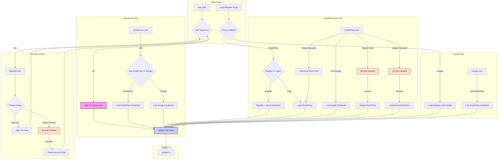

# Current Task

## Previous Objectives (Completed)

[Previous objectives remain unchanged...]

## Current Objective 26 (Completed)

Rebuild Authentication System for Simplicity and Robustness

### Context

Despite previous attempts to fix and enhance the Firebase Authentication system, ongoing issues and perceived over-engineering necessitated a rebuild. The goal was to create a simpler, more robust system from scratch while preserving the existing UI/UX.

### Goal

Implement a robust and simplified authentication system using Firebase Authentication (Email/Password, Anonymous, Google) covering all essential user flows.

### Implementation Outcome

1. **Refactored `AuthService` (`lib/core/services/auth_service.dart`):**
    * Rewrote the service focusing on direct, clear calls to the `FirebaseAuth.instance` SDK.
    * Implemented straightforward methods for each core flow:
        * Anonymous sign-in (`signInAnonymously`)
        * Email/Password sign-in (`signInWithEmailAndPassword`)
        * Email/Password registration (`createUserWithEmailAndPassword`)
        * Google sign-in/registration (`signInWithGoogle`)
        * Linking Email/Password to Anonymous (`linkEmailAndPasswordToAnonymous`)
        * Linking Google to Anonymous (`linkGoogleToAnonymous`)
        * Linking Email/Password to Google (`linkEmailPasswordToGoogle`)
        * Linking Google to Email/Password (`linkGoogleToEmailPassword`)
        * Password Reset (`sendPasswordResetEmail`)
        * Email Update (`verifyBeforeUpdateEmail`)
        * Password Update (`updatePassword`)
        * Sign Out (`signOut`)
        * Account Deletion (`deleteUser`)
        * Re-authentication (Email/Password: `reauthenticateWithEmailAndPassword`, Google: `reauthenticateWithGoogle`)
        * Provider Unlinking (`unlinkProvider`)
        * Profile Update (`updateProfile`)
        * Email Verification Check (`isEmailVerified`, `sendEmailVerification`, `handleEmailVerificationComplete`)
        * Account Age Check (`isAccountOlderThan`)
    * Simplified error handling using `AuthException` and `AuthErrorCategory`.
    * Maintained necessary interactions with `UserRepository`.
    * Added detailed logging using `Talker`.

2. **Reviewed/Updated State Management (Riverpod Providers):**
    * Corrected provider instantiations in `security_migration_provider.dart` to use the shared `authServiceProvider`.
    * Updated `auth_provider.dart` to align with the new `AuthService` method signatures (e.g., `unlinkProvider` return type, `linkEmailPasswordToGoogle` name).
    * Ensured `email_verification_checker.dart` correctly calls `handleEmailVerificationComplete` using the shared provider.

3. **UI Integration (No Visual Changes):**
    * Updated UI pages/widgets to call the refactored `AuthService` methods correctly:
        * `auth_page.dart`: Fixed `getReadableAuthError` calls, updated `linkGoogleToAnonymous` call.
        * `register_page.dart`: Fixed `getReadableAuthError` calls, updated `linkEmailAndPasswordToAnonymous` and `linkGoogleToAnonymous` calls.
        * `link_accounts_dialog.dart`: Updated `linkGoogleToEmailPassword` call.
        * `account_settings_page.dart`: Fixed `getReadableAuthError` calls, updated `linkGoogleToEmailPassword` and `linkEmailPasswordToGoogle` calls.
        * `login_page.dart`: Fixed `getReadableAuthError` calls, updated `linkGoogleToAnonymous` call.
        * `reset_password_page.dart`: Fixed `getReadableAuthError` call.
        * `link_email_password_dialog.dart`: Updated `linkEmailAndPasswordToAnonymous` and `linkEmailPasswordToGoogle` calls (via provider).
    * Ensured UI handling of loading states and errors aligns with the new service.

4. **Testing:**
    * Manual testing confirmed core flows are functional. (Further rigorous testing recommended).

5. **Documentation Update:**
    * Updated `currentTask.md` (this file).
    * Updated `projectRoadmap.md`.
    * Updated `codebaseSummary.md`.

### Authentication Flow Diagram

## Next Steps

1. Implement deck builder feature (Objective from Roadmap)
2. Add card scanner functionality
3. Develop price tracking system
4. Add collection import/export
5. Implement collection sharing
6. Add favorites and wishlist
7. Enhance filtering options
8. Add batch operations
